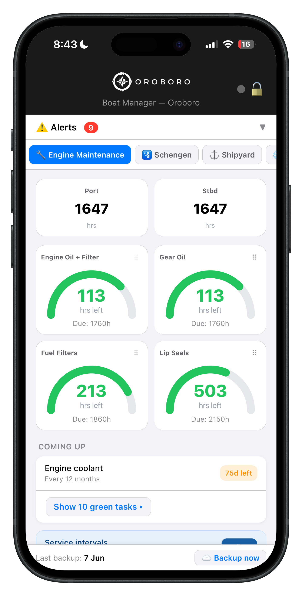
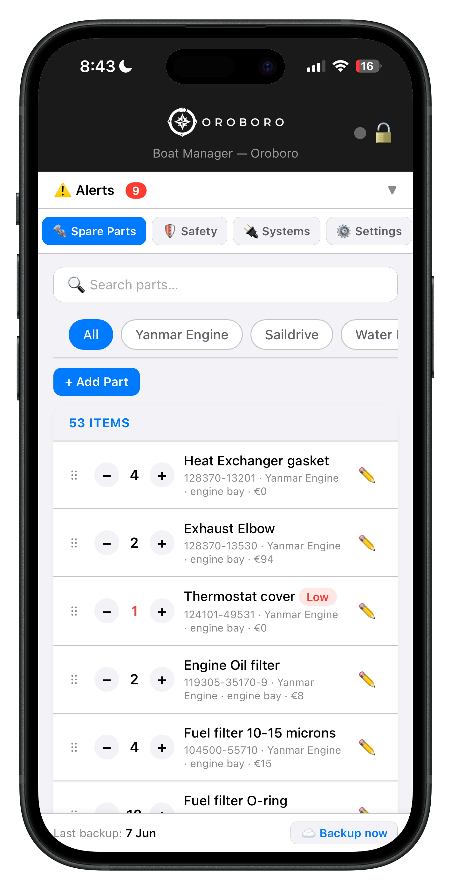
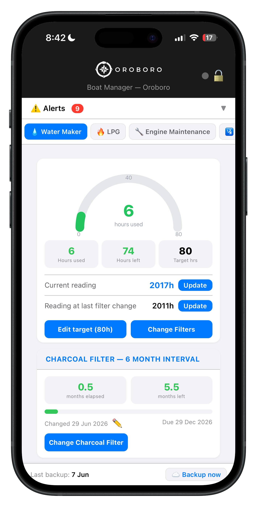
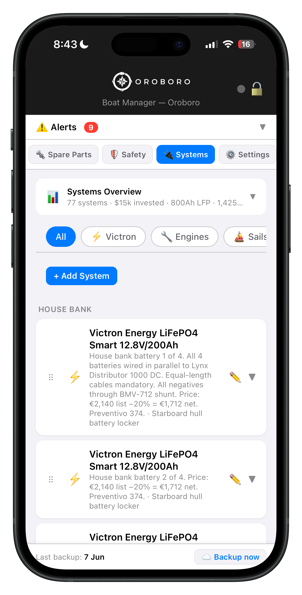
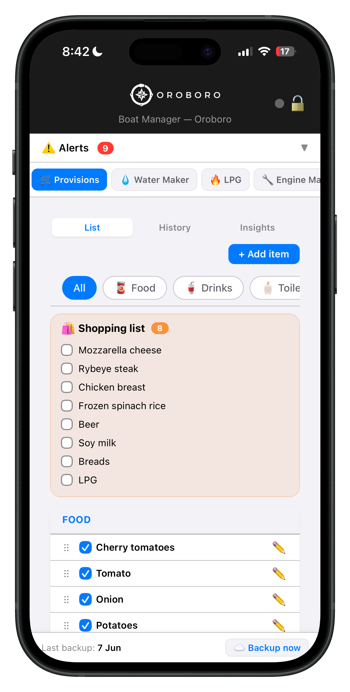
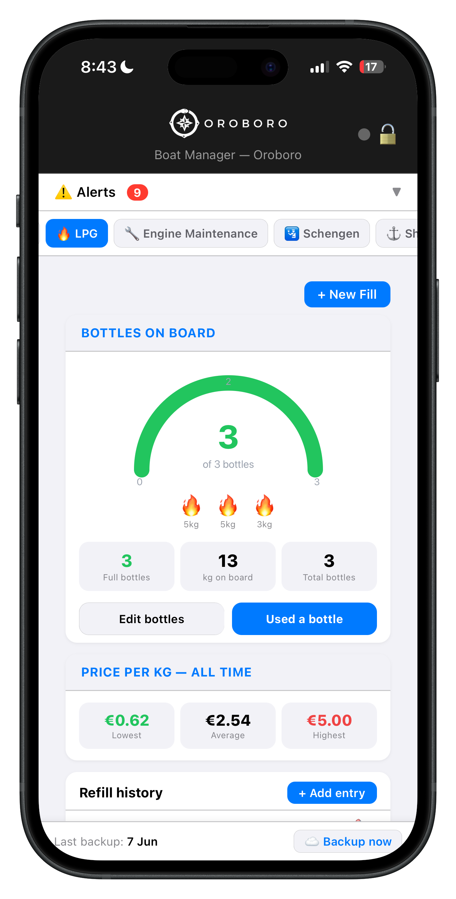
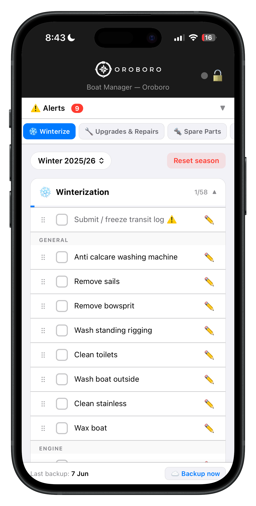
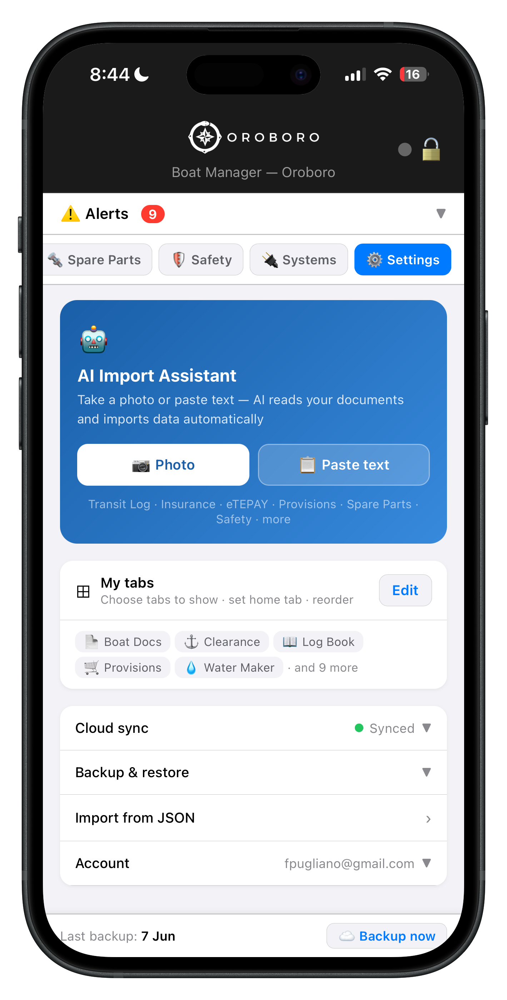

# Oroboro Boat Manager

> Built by a sailor with 30,000nm and 3 ocean crossings. Finally, a boat management app built by someone who actually left the dock.

**Live app → [boat.sailingoroboro.com](https://boat.sailingoroboro.com)**

[](https://boat.sailingoroboro.com)
[](LICENSE)


---

## Screenshots

<p align="center">
  
  
  
  
</p>
<p align="center">
  
  
  
  
</p>

---

## What it is

Oroboro Boat Manager is a mobile-first progressive web app (PWA) for bluewater sailors. It keeps everything about your boat in one place — engine maintenance, spare parts, documents, provisions, watermaker, LPG, shipyard history, safety gear, crew, and all the Greek paperwork that can sink your season.

No installation. No App Store. No Google Play. Open it in any browser, save to your home screen, and it looks and feels like a native app.

---

## Features

### 🔧 Engine Maintenance
- Track engine hours for port, starboard, and genset engines independently
- Automatic maintenance alerts — oil change, impeller, belts, fuel filters, heat exchanger, mixing elbow, saildrive, and more
- Configurable service intervals with custom tasks
- Full maintenance log with filtering by task type

### ⛽ Diesel
- Multi-tank fuel tracking with per-engine hours
- Refill history with price-per-litre and consumption analysis
- Filter by season

### 📖 Log Book
- Passage log and coastal log entries
- Printable / exportable passage reports

### 📦 Spare Parts
- Inventory with quantities and minimum stock levels
- Low stock warnings
- Part numbers, locations, store URLs
- Category filtering (Yanmar Engine, Saildrive, Watermaker, Oils & Fluids, Outboard, etc.)
- Live search and one-tap **CSV export**

### 📄 Documents
- Vessel registration
- Insurance (with renewal history)
- Greek Transit Log (Δελτίο Κίνησης)
- Greek eTEPAY customs payment
- Crew list with passport and seaman's book expiry tracking

### 🛂 Schengen Tracker
- Rolling 180-day window calculator (the brutal one most apps don't even know about)
- Multiple passport support per person
- Entry/exit log with check-in and check-out

### 🌊 Watermaker
- Hour meter tracking
- Filter change reminders (5 micron, 20 micron, charcoal)
- Filter change history with location log

### 🛥️ Shipyard
- Current haul-out tracking with costs and dates
- Quote comparison
- Full season history

### 🔥 LPG
- Bottle inventory
- Refill history with price per kg tracking

### 🥫 Provisions
- Shopping list and inventory
- Category organisation

### ⛵ Systems
- Installed equipment register (Victron, navigation, sails, rigging, etc.)
- Serial numbers, install dates, warranty expiry, manual URLs
- Purchase details (price, supplier, invoice ref)
- Live search and **XLS export**

### ❄️ Winterize
- Season checklists: winterize, spring re-commission, and "needs" shopping list
- Reusable task templates carried over each season

### 🚨 Safety
- Flare inventory with expiry tracking
- Life raft service history

### 🏗️ Upgrades & Repairs
- Season-by-season refit tracking
- Line-item costs

### 📷 AI Import Assistant
- Point your phone at any document — insurance certificate, spare part label, maintenance receipt, chandlery invoice, Transit Log, Victron device sticker — and AI reads it and imports it into the correct tab automatically
- No copy-paste. No reformatting. Up and running in the blink of an eye.
- Supports photos and text paste
- Multilingual (Greek, French, Italian, Spanish, Norwegian, Polish, and more)

---

## Security & Privacy

All data is **end-to-end encrypted in your browser** before it ever leaves your device.

- Encryption: AES-GCM 256-bit
- Key derivation: PBKDF2 (100,000 iterations) from your PIN
- The server (Cloudflare Worker) only ever sees encrypted blobs — it cannot read your data
- Auto-lock after 5 minutes of inactivity
- Brute-force protection (5 attempts → 30-second lockout)

---

## Tech Stack

| Layer | Technology |
|---|---|
| Frontend | Vanilla JS, HTML, CSS — no framework |
| Backend | Cloudflare Worker |
| Storage | Cloudflare KV (encrypted blobs) |
| AI | Anthropic Claude (`claude-sonnet-4-6`) |
| Hosting | GitHub Pages + Cloudflare |

---

## Repository Structure

```
index.html          App shell (PWA metadata, entry point)
app.js              All frontend logic (~13,000 lines)
boat-worker.js      Cloudflare Worker — API + AI proxy
styles.css          All styles
owner-config.js     Owner-specific config, committed with placeholders (see Deployment)
wrangler.toml       Cloudflare Worker deployment config
logo.js             Oroboro logo as JS constant
oroboro-icon.js     App icon as JS constant
admin.html          Admin dashboard (usage analytics)
clear.html          Utility page to clear local storage
CLOUDFLARE-SETUP.md Cloudflare deployment instructions
```

---

## Deployment

This app is designed to be deployed by a single owner. It is not a multi-tenant SaaS — it runs for one person/boat and their circle.

### Prerequisites
- A Cloudflare account (free tier is sufficient)
- Node.js and Wrangler CLI (`npm install -g wrangler`)
- A GitHub account (for GitHub Pages hosting)

### 1. Fork and configure

Fork this repo, then edit `owner-config.js`:

```js
const OWNER_EMAIL       = 'your@email.com';
const OWNER_STORAGE_URL = 'https://your-worker-name.your-account.workers.dev';
const ADMIN_PASSWORD    = 'CHANGE_ME'; // leave as placeholder — see note below
```

> ⚠️ **Never commit a real password here.** `owner-config.js` is served publicly by
> the browser. The admin dashboard prompts for the password and validates it against the
> Cloudflare Worker secret, so the real value only ever needs to live in the Worker secret
> (`wrangler secret put ADMIN_PASSWORD`) — keep the placeholder in this file.

### 2. Deploy the Cloudflare Worker

```bash
# Login to Cloudflare
wrangler login

# Create a KV namespace
wrangler kv namespace create "BOAT_DATA"
# Copy the returned ID into wrangler.toml

# Set secrets
wrangler secret put ANTHROPIC_API_KEY
wrangler secret put ADMIN_PASSWORD

# Deploy
wrangler deploy
```

### 3. Deploy the frontend

Enable GitHub Pages on your fork (Settings → Pages → Deploy from branch: `main`). Set a custom domain if desired via the `CNAME` file.

### 4. Full setup guide

See [CLOUDFLARE-SETUP.md](CLOUDFLARE-SETUP.md) for detailed instructions.

---

## License

Released under the [MIT License](LICENSE) — free to use, modify, and self-host, with attribution. Copyright © 2024–2026 Francesco Pugliano.

The name "Oroboro", the logo, and the personal boat data in `oroboro-data.js` are not covered by the licence and remain the author's.

---

## About

Built by Francesco & Yuka aboard S/V Oroboro — Cape Town to Greece, 2018–present.

- 🌐 [sailingoroboro.com](https://sailingoroboro.com)
- 📱 [Live app](https://boat.sailingoroboro.com)
- 📸 [Instagram](https://www.instagram.com/sailingoroboro/)
